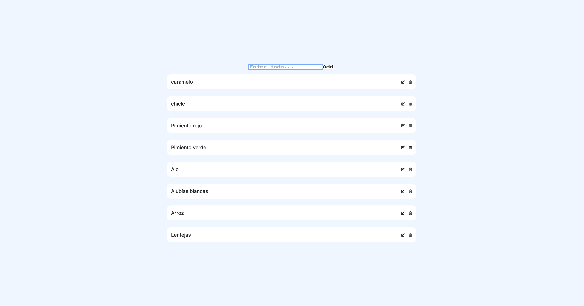

# TodoList App

Este proyecto es una aplicación de lista de tareas (TodoList) creada con React y Vite. Permite a los usuarios agregar, editar, eliminar y reorganizar tareas en una lista. Las tareas se guardan en el almacenamiento local del navegador para que persistan entre sesiones.



## Estructura del Proyecto

```sh
.DS_Store .gitignore .vscode/ settings.json eslint.config.js index.html package.json public/ README.md src/ .DS_Store App.jsx assets/ components/ .DS_Store TodoCard.jsx TodoInput.jsx TodoList.jsx index.css main.jsx setupTests.js test/ App.test.jsx TodoCard.test.jsx TodoInput.test.jsx TodoList.test.jsx vite.config.js
````

## Tecnologías Utilizadas

- **React**: Biblioteca de JavaScript para construir interfaces de usuario.
- **Vite**: Herramienta de construcción rápida para proyectos de frontend.
- **react-beautiful-dnd**: Biblioteca para implementar arrastrar y soltar en React.
- **PropTypes**: Biblioteca para la validación de tipos de propiedades en componentes de React.
- **Vitest**: Marco de pruebas unitarias para proyectos de Vite.
- **Testing Library**: Conjunto de utilidades para probar componentes de React.

## Instalación y Configuración

### Requisitos Previos

Asegúrate de tener instalado Node.js y npm en tu máquina.

### Instalación

1. Clona el repositorio:

```sh
git clone https://github.com/tu-usuario/react-todolist.git
cd react-todolist
````

2. Instala las dependencias:

```sh
npm install
````

## Ejecución en Desarrollo

Para iniciar el servidor de desarrollo, ejecuta:

```sh
npm run dev
````

## Construcción para Producción

Para construir la aplicación para producción, ejecuta:

```sh
npm run build
````

## Previsualización de la Construcción

Para previsualizar la construcción de producción, ejecuta:

```sh
npm run preview
````

## Pruebas

### Instalación de Dependencias de Pruebas

Instala las dependencias necesarias para las pruebas:

```sh
npm install --save-dev vitest @testing-library/react @testing-library/jest-dom @vitest/coverage-v8
````

### Ejecución de Pruebas

Para ejecutar las pruebas, usa el siguiente comando:

```sh
npm test
````

## Estructura de Componentes

- App.jsx
El componente principal que maneja el estado de la lista de tareas y la lógica de arrastrar y soltar.

- TodoInput.jsx
Un componente para ingresar nuevas tareas.

- TodoCard.jsx
Un componente para mostrar una tarea individual con opciones para editar y eliminar.

- TodoList.jsx
Un componente para renderizar la lista de tareas utilizando TodoCard.

# Estilos

Los estilos se encuentran en el archivo src/index.css. Utiliza Flexbox para la disposición de los elementos y proporciona una apariencia moderna y limpia.

## AUTHOR:

```sh
Pablo Abad
```

## Licencia

Este proyecto está licenciado bajo la Licencia MIT. Consulta el archivo LICENSE para obtener más detalles.

¡Gracias por usar TodoList App!